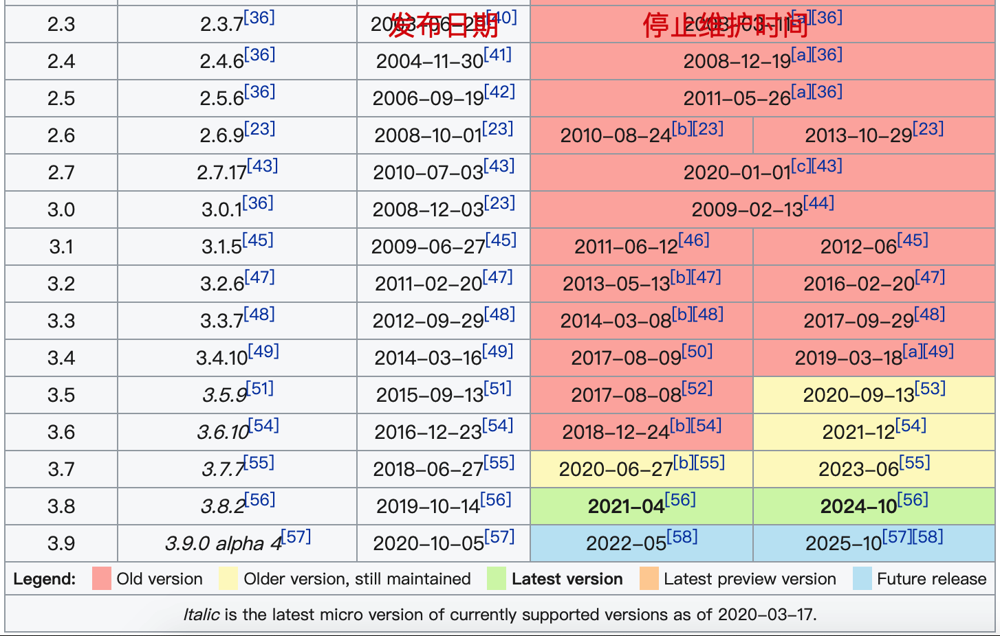

## 01-01-python介绍
### 1.python简介
python是面向对象的动态编程语言，支持函数式编程。继承了传统编译语言的强大性和通用性，同时借鉴简单脚本和解释语言的易用性。

### 2.python发展历史
这个地方我自己就不过多介绍了，可以参考下面两篇百科。

[百度百科-python](https://baike.baidu.com/item/Python/407313)

[维基百科-python](https://en.wikipedia.org/wiki/History_of_Python)

### 3.python使用方向
1. 科学计算
2. 人工智能 (python最近这几年火起来很重要的一个原因)
3. 系统运维（相比shell可读性更高）
3. WEB后端程序开发
4. GUI开发
5. 游戏开发
6. 嵌入式开发

### 4.python版本选择

1. 优先选择Python3

> 为什么? 因为现在已经是2020年了,python2的最后一个版本,python2.7都已经不再维护了,你还学什么呢?新学python,肯定python3,不要纠结了。

2. python2的编码问题很烦人

> 在python2当中默认的编码是ascill码，而在python3当中unicode码，这就是为什么两个版本不能相互兼容的原因。
