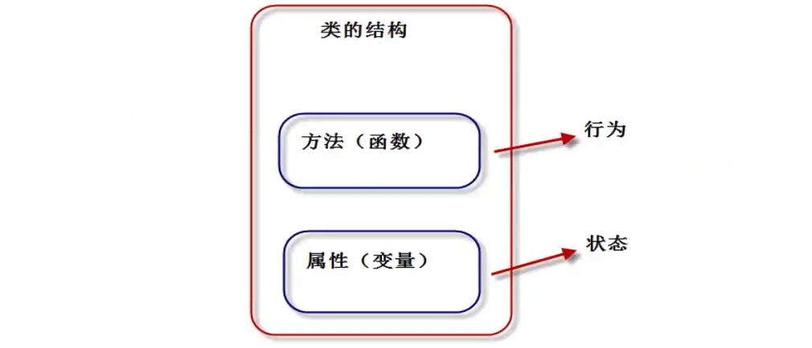
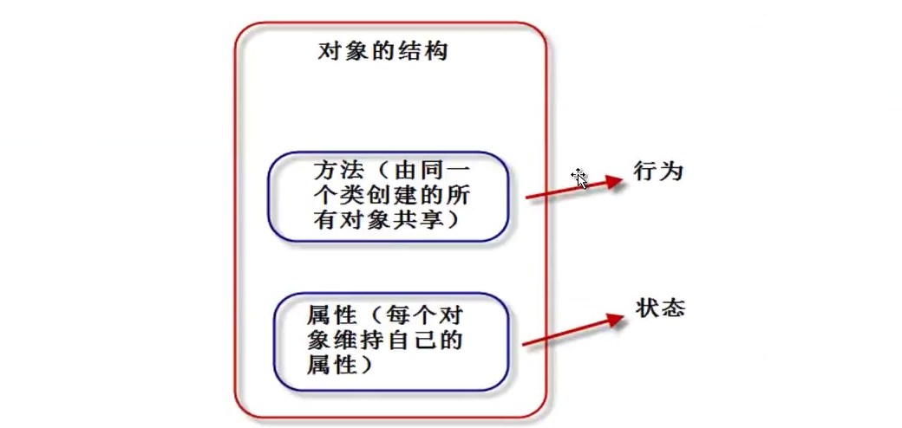

## python-06面向对象-03类的定义/类和对象的关系/isinstance()方法

### 1.类和对象
我们把对象比作一个“饼干”，类就是制作这个饼干的“模具”。  

我们通过类定义不同数据类型的属性(数据)和方法(行为)，也就是说，“类将行为和状态(数据)打包在一起”。


对象是类的具体实例，一般称为“类的实例”。类看做“饼干模具”，对象就是根据这个“模具”，制造出来的“饼干”。

从一个类创建对象时，每个对象会共享这个类的行为(类中定义的方法)，但会有自己的属性值（不共享状态）。更具体一点：“方法代码是共享的，属性数据不共享”。

Python中，“一切皆对象”.类也称为“类对象”， 类的实例也称为“实例对象”。


### 2.类与对象的定义
#### 2.1 类的定义
```python
class 类名：
	类体
```
#### 2.2 对象的定义
```python
	# 方式1
	对象名 = 类名()
	
	# 方式2
	对象名 = 类名(参数1， 参数2， ...参数n)
```
注意：  
> 在python中实例化对象的时候，不需要关键字new，这个和一般面向对象的语言不太一样。

### 3.注意事项

要点如下：

1. 类名必须符合“标识符”的规则(字母、数字、下划线组成，首字母不为数字)。一般规定，首字母大写，多个单词使用“驼峰原则”。
2. 类体中我们可以定义属性和方法。
3. 属性用来描述数据，方法(即函数)用来描述这些数据相关的操作。


### 4.类与对象具体案例

```python
# 定义类
class Student:
    count = 0                                           # 类属性
	
    def __init__(self, name, age):
        '''
        初始化方法
        注意：self参数固定放在起始位置，变量名可以是其他，但一般使用self
        '''
        self.name = name                                # 实例属性
        self.age = age
        Student.count = Student.count + 1
	
    def say_age(self):                                  # 实例方法
        print(self.name + "的年龄是" + str(self.age))
	
s1 = Student("聂发俊", 100)			# 实际上执行了两个方法
s1.say_age()
```
执行结果：

> 聂发俊的年龄是100


### 5. isinstance()方法

#### 5.1 基础概念

官方解释：

```python
"""
Return whether an object is an instance of a class or of a subclass thereof.
"""
```
返回一个对象是否是一个类或者其子类的实例。（**注意子类的情况**）

代码说明：

```python
class A(object):
    pass

class B(A):
    """代表类B继承类A"""
    pass

class C:
    pass

b1 = B()
print(isinstance(b1, A))
print(isinstance(b1, B))
print(isinstance(b1, C))
```
运行结果：

```python
True
True
False
```

解释: 对象b1是通过类B创建出来的，所以对象b1是类B是属于实例关系,第二个结果为True。类B是类A的子类，也就是对象b1是类A的子类B的实例，第一个结果为True。对象b1和类C没有关系，所以第三个为False。


#### 5.2  使用isinstance()判断数据类型

代码说明：   

```python
boo = True
print(isinstance(boo, bool))

num1 = 10
print(isinstance(num1, int))

num2 = 10.0
print(isinstance(num2, float))

str1 = 'abc'
print(isinstance(str1, str))

list1 = ['a', 'b', 'c']
print(isinstance(list1, list))

tup1 = (1, 2, 3)
print(isinstance(tup1, tuple))

dic1 = {'key1': 'val1', 'key2': 'val2'}
print(isinstance(dic1, dict))

set1 = {'a', 'b'}
print(isinstance(set1, set))
```

运行结果：

```python
True
True
True
True
True
True
True
True
```

使用isinstance()在程序中比较常见，主要是针对方法的参数等输入变量。


---
>  备注：   
>  更多精彩博客，请访问:[聂发俊的技术博客](http://www.niefajun.com/)  
>
>  对应视频教程，请访问:[python400](https://www.bilibili.com/video/BV1WE411j7p3)  
>
>  完整markdown笔记，请访问: [python400_learn_github](https://github.com/niefajun/python400_learn)
