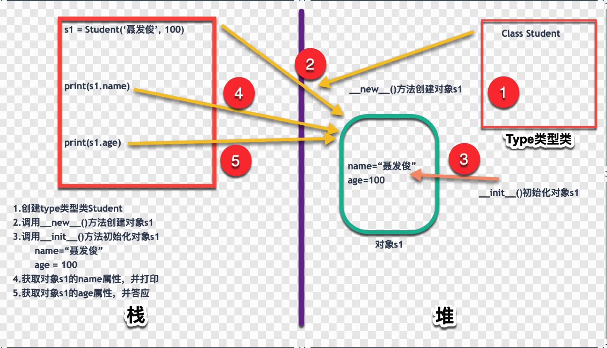

## python-06面向对象-05实例属性/dir()方法/对象dict属性

### 1.实例属性要点
实例属性是从属于实例对象的属性，也称之为“实例变量”。他的特点有如下几个要点：

1. 实例属性一般在`__init__()`方法中通过如下代码进行定义：

	```python
	self.实例属性名 = 初始值
	```
	
2. 在本类的其他实例方法中，也是通过self访问实例属性。  

	```python
	self.实例属性名
	```
	
3. 创建实例对象以后，通过实例对象访问实例属性。

	```python
	obj = 类名()		# 创建对象，调用__init__()方法进行初始化
	
	# 获取实例属性值
	print(obj.实例属性名)
	
	# 对实例属性进行赋值
	obj.实例属性名 = 值
	```
	
	
### 2.实例属性内存结构分析
#### 2.1 经典代码

```python
class Student:
    def __init__(self, name, age):
        self.name = name                                # 实例属性
        self.age = age

s1 = Student("聂发俊", 100)
print(s1.name)
print(s1.age)
```
运行结果：

```python
聂发俊
100
```

#### 2.2 程序运行内存结构
说明：<font color='red'>下面的示意图存在问题，这个示意图是按照java的内存模型绘制的，实际python(采用cpython)的内存模型不一致，文档描述：Memory management in Python involves a private heap containing all Python objects and data structures.</font>文档地址：[python内存管理](https://docs.python.org/3.7/c-api/memory.html?highlight=memory)

程序结构以及对应步骤，均已经通过图片的形式展示。

> 目前使用gif动画还不熟悉，后面如果熟悉的话，考虑录一个gif动画来说明，这样效果可能会更好一些。


### 3.dir()方法和__dict__属性

dir(obj)可以获得对象的所有属性列表, 而`obj.__dict__`对象的自定义属性字典
注意事项：

1. dir(obj)获取的属性列表中，**方法也认为属性的一种**。返回的是list
2. `obj.__dict__`只能获取自己自定义的属性，系统内置属性无法获取。返回是dict

代码说明:

```python 
class Student:
    def __init__(self, name, score):
        self.name = name
        self.score = score
 
s1 = Student("聂发俊", 100)
print("获取所有的属性列表")
print(dir(s1))

print("--" * 20)
print("获取自定义属性字段")
print(s1.__dict__)
```
运行结果：

```python
获取所有的属性列表
['__class__', '__delattr__', '__dict__', '__dir__', '__doc__', '__eq__', '__format__', '__ge__', '__getattribute__', '__gt__', '__hash__', '__init__', '__init_subclass__', '__le__', '__lt__', '__module__', '__ne__', '__new__', '__reduce__', '__reduce_ex__', '__repr__', '__setattr__', '__sizeof__', '__str__', '__subclasshook__', '__weakref__', 'name', 'score']
----------------------------------------
获取自定义属性字段
{'name': '聂发俊', 'score': 100}
```


---

> 备注：   
> 更多精彩博客，请访问:[聂发俊的技术博客](http://www.niefajun.com/)  
> 对应视频教程，请访问:[python400](https://www.bilibili.com/video/BV1WE411j7p3)  
> 完整markdown笔记，请访问: [python400_learn_github](https://github.com/niefajun/python400_learn)


​	