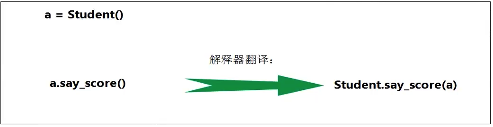
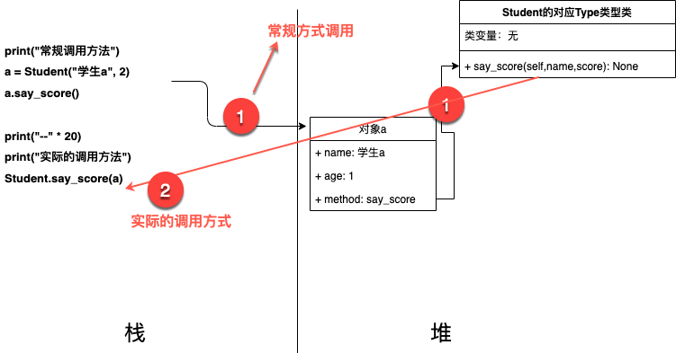

## python-06面向对象-06实例方法

### 1.实例方法简介
实例方法是从属于实例对象的方法。实例方法的定义格式如下：

```python
def 方法名(self [, 形参列表])：
	函数体
```
实例方法的调用格式如下:  

```python
对象.方法名([实参列表])
```
要点：

1. 定义实例方法时，第一个参数必须为self。和前面介绍一样，self指当前的实例对象。
2. 调用实例方法时， **不需要也不能给self传参。self由解释器自动传参**。


函数和方法的区别：

- 都是用来完成一个功能的语句块，本质都是实现功能。
- 实例方法调用时，通过实例对象来调用。实例方法从属于特定实例对象，普通函数没有这个特点。
- 直观上看，方法定义时需要传递self，函数不需要。


### 2.实例方法底层说明

#### 2.1 引题
使用两种方法调用实例方法，来说明情况: 

```python 
class Student:
    def __init__(self, name, score):
        self.name = name
        self.score = score

    def say_score(self):
        print("{0}的分数是:{1}".format(self.name, self.score))

print("常规调用方法")
a = Student("学生a", 2)
a.say_score()

print("--" * 20)
print("实际的调用方法")
Student.say_score(a)
```
运行结果：

```python
常规调用方法
学生a的分数是:2
----------------------------------------
实际的调用方法
学生a的分数是:2
```


#### 2.2 初步结论

运行上面的代码，我们发现: 运行的结果是一致的。从而引出下面的简单结论:

实例对象的方法调用本质：



#### 2.3 进一步的内存结构说明
说明：<font color='red'>下面的示意图存在问题，这个示意图是按照java的内存模型绘制的，实际python(采用cpython)的内存模型不一致，文档描述：Memory management in Python involves a private heap containing all Python objects and data structures.</font>文档地址：[python内存管理](https://docs.python.org/3.7/c-api/memory.html?highlight=memory)


说明: 实例方法虽然从属于对象，但是在类中共享，这也是第二种方法，通过类寻找实例方法，传递对应的实例对象的就可以执行对应的功能。

> 这也从另外一个角度来说明：为什么在python中定义实例方法的时候为什么第一个参数始终是self，因为方法如上图一样，共享在类中，为了区分到底哪个对象调用方法，需要把对应对象也要传递过来。


---
> 备注：   
> 更多精彩博客，请访问:[聂发俊的技术博客](http://www.niefajun.com/)  
> 对应视频教程，请访问:[python400](https://www.bilibili.com/video/BV1WE411j7p3)  
> 完整markdown笔记，请访问: [python400_learn_github](https://github.com/niefajun/python400_learn)
