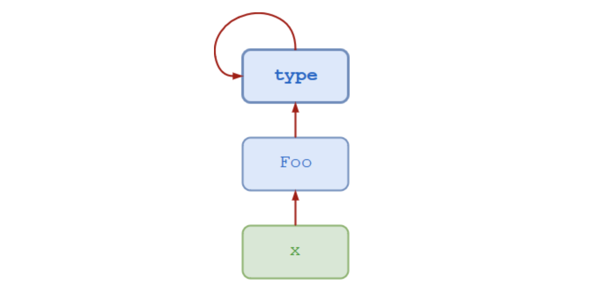

## python-面向对象-07类对象/元类metaclass

### 1.引题
类对象？是什么鬼？对象不是类的实例么，那类对象是什么意思？在Python中，普通类既是一个类，但同时也是一个对象(也叫做类对象)，对的，你没有看错。不信？我们看一个例子。

```python
class Student:
    pass        # 空语句

# 实例化对象
s1 = Student()

print("对象s1的id和type和__class__")
print(id(s1))
print(type(s1))
print(s1.__class__)

print("--" * 10)
print("类Student的id和type和__class__")
print(id(Student))
print(type(Student))
print(Student.__class__)

```
执行结果：

```python
对象s1的id和type
4489106320
<class '__main__.Student'>
<class '__main__.Student'>
--------------------
类Student的id和type
140254813901664
<class 'type'>
<class 'type'>
```

通过执行结果可以看到:

1. 首先对象s1和类Student的id值，也就是存储的内存地址，数值相差比较大，至少说明对象和类是分区域存储的。
2. 在python3中type函数和`__class__`的效果相同,也就是说在python3中这两者是一致(后面有补充说明)。
3. `__class__`属性会指向该实例对应的类，类Student的`__class__`属性值为`<class 'type'>`,由此我们可以知道类Student是类type的实例。从这个角度上来说，普通类也是一个对象。

### 2.Metaclasses登场
`Metaclasses`中文名称是`元类`,元类是一个深奥的OOP概念，隐藏在几乎所有Python代码背后。不管你是否意识到，你都在使用它们。在大多数情况下，你不需要意识到它。大多数Python程序员很少(如果有的话)需要考虑元类。

在我自己的实际工作中几乎没有特意使用过元类。

`python之禅`的作者Tim Peters对于Metaclasses的描述：
> “Metaclasses are deeper magic than 99% of users should ever worry about. If you wonder whether you need them, you don’t (the people who actually need them know with certainty that they need them, and don’t need an explanation about why).”
>
> 译文：
>
> 元类的魔力比99%的用户所担心的都要深。如果你想知道你是否需要它们，你不需要(真正需要它们的人肯定知道他们需要它们，不需要解释为什么)。

> — Tim Peters

我第一次看到这句话的时候，也有一些蒙圈。下面我们就一步一步来揭开`Metaclasses`的神秘面纱。

### 3.旧式类和新式类
在Python领域中，类可以是两种变体之一。官方的术语对于这一部分还没有确定，所以它们被非正式地称为旧式和新式类。

#### 3.1 旧式(Old-Style)类
对于旧式的类，类和类型不是完全相同的东西。旧式类的实例总是由一个称为`instance`的内置类型实现。如果obj是一个旧式类的实例，那么`obj.__class__`指向具体的类，但类型(obj)总是`instance`。下面的例子摘自Python 2.7命令行:

```python
>>> import sys
>>> print sys.version
2.7.16 (default, Dec 13 2019, 18:00:32)
[GCC 4.2.1 Compatible Apple LLVM 11.0.0 (clang-1100.0.32.4) (-macos10.15-objc-s
>>> class Foo:
...     pass
...
>>> x = Foo()
>>> x.__class__
<class __main__.Foo at 0x10b383a10>
>>> type(x)
<type 'instance'>
```

#### 3.2 新式(New-Style)类
在python3中，新型的类统一了类和类型的概念。如果obj是一个新样式类的实例，那么type(obj)与`obj._ class__`是相同的,均为class，不在继续使用`instace`.

```python
>>> import sys
>>> sys.version
'3.7.7 (v3.7.7:d7c567b08f, Mar 10 2020, 02:56:16) \n[Clang 6.0 (clang-600.0.57)]'
>>> class Foo:
...     pass
...
>>> obj = Foo()
>>> obj.__class__
<class '__main__.Foo'>
>>> type(obj)
<class '__main__.Foo'>
>>> obj.__class__ is type(obj)
True
```


#### 3.3 新式类和旧式类总结
在python2中，类默认是旧式类。在python2.2版本之前，新式类根本不支持。在python2.2以及后续的python2版本中，能够创建新式类，但是必须指定为新式类。  
在python3中，所有的类默认是新式类。因此，在python3中，`type(类)`和`类.__class__`是一致的。


### 4 类和类型
#### 4.1 代码分析
还是用我们刚才使用的例子进行分析

```python
>>> class Foo():
...     pass
...
>>> x = Foo()
>>> type(x)
<class '__main__.Foo'>
>>> type(x)
<class '__main__.Foo'>
```
在这个例子中：

- 对象x是类Foo的实例。
- 类Foo是type元类(metaclass)的实例。
- type元类也是type元类(metaclass)的实例，所以type元类是自身的一个实例。



#### 4.2 使用type函数动态定义类
type函数官方定义：

```python
    def __init__(cls, what, bases=None, dict=None): # known special case of type.__init__
        """
        type(object_or_name, bases, dict)
        type(object) -> the object's type
        type(name, bases, dict) -> a new type
        # (copied from class doc)
        """
        pass
```

- `<bases>`指定基类的元组，该类从该元组继承基类.这成为类的`__bases__`属性。
- `<dict>`指定包含类主体定义的名称空间字典，这成为类的` __dict__`属性。

以这种方式调用type()将创建类型元类的一个新实例。换句话说，它动态地创建一个新类。

示例：

```python
>>> Foo = type('Foo', (), {})
>>> x = Foo()
>>> x
<__main__.Foo object at 0x106869f90>
```
再一次说明，普通类是通过type类创建出来的。


### 5.自定义Metaclasses
#### 5.1 代码分析
```python
>>> class Foo:
...     pass
...
>>> f = Foo()
```

表达式Foo()创建类Foo的一个新的实例。当解释器执行Foo()的时候，会执行如下操作：

1. 按照类继承关系，首先类Foo的父类`__call__()`方法被调用(**后续的笔记会补充这一部分的说明**)。因为Foo是一个标准的新式类，那么Foo父类就是type元类(metaclasss),所以type的`__call__()`的方法被调用。  
2. `__call__()`方法按照顺序调用如下方法:
	- `__new__()`
	- `__init__()`

如果类Foo没有定义`__new__()`和`__init()__`方法，默认方法则从类Foo的父类继承而来。但是如果类Foo定义了以上两个方法，则重写了父类的对应的方法，当我们实例化Foo的时候，可以Foo的实例进行自定义。

```python
>>> class Meta(type):
...     def __new__(cls, name, bases, dct):
...             x = super().__new__(cls, name, bases, dct)
...             x.attr = 100
...             return x
...
>>> class Foo(metaclass=Meta):
...     pass
...
>>> Foo.attr
100
>>> class  Bar(metaclass=Meta):
...     pass
...
>>> Bar.attr
100
```
首先定义了 一个继承type元类的自定义类Meta，因为继承type元类，所以类Meta是一个自定义元类。然后重写其中的`__new__`方法，对每一个通过自定义元类Meta创建的普通类，都增加一个类属性attr，并且给类属性赋值100。后面通过两次指定`(metaclass=Meta)`的方式来创建类，来实现调用自定义元类创建类。最后在两个类中均存在属性`attr`，并且对应的值为100.

### 6.自定义metaclass是必需的么？
刚才我们通过自定义元类的方式实现功能，实际上能够通过其他方式也能够实现，下面我们展示其中的两种方法。   
第一种方法：使用普通继承

```python
class Base:
    attr = 100

class X(Base):
    pass

class Y(Base):
    pass

class Z(Base):
    pass

print(X.attr)
print(Y.attr)
print(Z.attr)
```

执行结果：
```python
100
100
100
```


第二种方法:使用装饰器  

```python
def decorator(cls):
    """定义一个带类属性attr=100的新类"""
    class NewClass(cls):
        attr = 100
    """返回类"""
    return NewClass

@decorator
class X:
    pass

@decorator
class Y:
    pass

@decorator
class Z:
    pass

print(X.attr)
print(Y.attr)
print(Z.attr)
```
执行结果:

```python
100
100
100
```

正如python之禅的作者`Tim Peters`所建议的那样:如果对于元类不清楚，就不要考虑使用元类。通常没有必要创建自定义元类。如果手头上的问题可以用一种更简单的方法来解决，那么它可能应该是这样的。尽管如此，理解元类仍然是有益的。

参考列表:  
1. [https://realpython.com/python-metaclasses/](https://realpython.com/python-metaclasses/)  realpython网站有很多很不错的python教程

---
> 备注：   
> 更多精彩博客，请访问:[聂发俊的技术博客](http://www.niefajun.com/)  
> 对应视频教程，请访问:[python400](https://www.bilibili.com/video/BV1WE411j7p3)  
> 完整markdown笔记，请访问: [python400_learn_github](https://github.com/niefajun/python400_learn)

