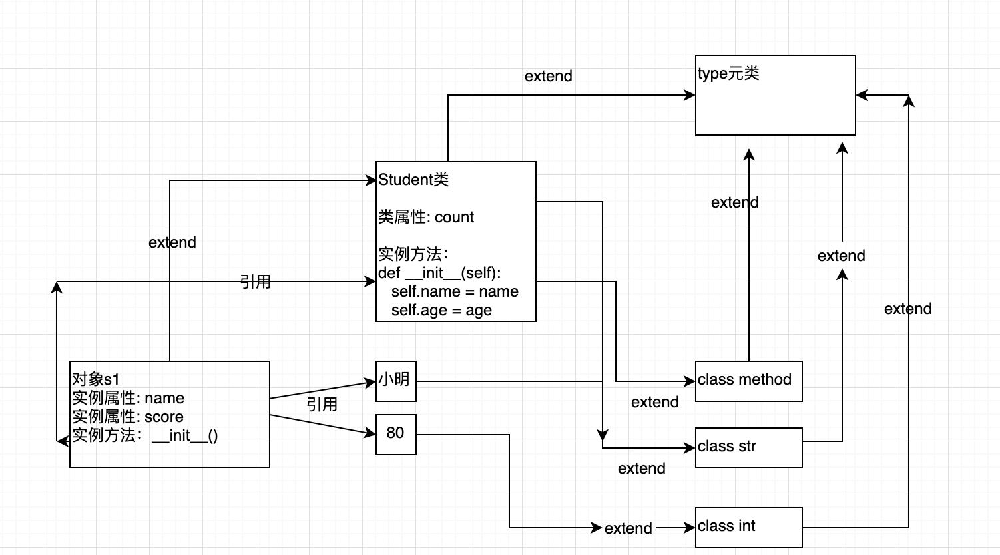

## python-面向对象-08类属性

### 1.类属性基本概念
类属性从属于"类对象"的属性，也称之为"类变量"。由于，类属性从属于类对象，可以被所有的实例对象所共享。  

类属性的定义方法：

```python
class 类名:
	类变量名 = 初始值
```
在类里面或者在类的外面，我们可以通过：`类名.类属性名`来进行读取、赋值等相关操作。

### 2.类属性代码说明
#### 2.1 代码部分
```python
class Student:
    count = 0                           # 类属性

    def __init__(self, name, score):
        self.name = name                # 实例属性
        self.score = score
        Student.count += 1


print("--" * 20)
print("读取实例属性")
s1 = Student("小明", 80)
print("s1.name={0}".format(s1.name))
print("s1.score={0}".format(s1.score))

print("--" * 20)
print("读取类属性")
print("Student.count={0}".format(Student.count))

print("--" * 20)
print("修改类属性")
Student.count = 0
print("Student.count={0}".format(Student.count))
```
运行结果：

```python
----------------------------------------
读取实例属性
s1.name=小明
s1.score=80
----------------------------------------
读取类属性
Student.count=1
----------------------------------------
修改类属性
Student.count=0
```

读取、操作对象属性，采用`对象名.实例属性`的方式；读取、操作类属性，采用`类名.类属性`的方式。

#### 2.2 类属性结构


说明: 实例属性name/score存储在对象当中，类属性count存储于类Student当中。另外python中一切皆对象，包括我们经常使用内置基础数据类型(str、int、list、dict、tuple等等）。


---
> 备注：   
> 更多精彩博客，请访问:[聂发俊的技术博客](http://www.niefajun.com/)  
> 对应视频教程，请访问:[python400](https://www.bilibili.com/video/BV1WE411j7p3)  
> 完整markdown笔记，请访问: [python400_learn_github](https://github.com/niefajun/python400_learn)
