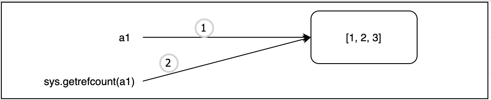

> Python语言自带垃圾回收机制，为了能够比较清楚说明白Python的垃圾回收机制的原理，我们今天就从最底层的解释器开始，采用由内到外的方式来说明。

### 1.Python默认解释器CPython

Python语言拥有多种解释器，但是默认采用CPython实现。CPython实际上是用C语言编写的。主要功能如下：
1. 编译python代码为字节码(bytecode)
2. 在虚拟机上面运行编译好的python程序


CPython是用C语言编写的，而C语言本身并不支持面向对象编程。正因为如此，在CPython代码中有很多很有意思的设计，来实现这些原本不支持的的功能。：如PyObject。

PyObject是Python中所有对象的鼻祖，它只包含两种东西:
- `ob_refcnt`: 引用计数
- `ob_type`: 指向另一种类型的指针

`ob_refcnt`引用计数用于接下来要说明的垃圾收集。

### 2.垃圾回收机制


#### 2.1 垃圾回收简单说明
Python中的垃圾回收回收机制采用引用计数的策略来实现，当一个对象的`ob_refcnt`大于0，说明存在引用，此时改对象不会进行垃圾回收。当一个对象 的`ob_refcnt`的引用数目等于0的时候，说明该对象没有任何引用，说明是一个闲置废弃的对象，会进入垃圾回收的阶段。

> Python允许您使用sys模块检查对象的当前引用计数。可以使用sys.getrefcount(numbers)，但是要记住，**将对象传递给getrefcount()会使引用计数增加1**。


下面我们几段代码来演示一下：

#### 2.2 引用计数入门示例
```python
import sys

a1 = [1, 2, 3]
print(sys.getrefcount(a1))
```
运行结果：
```
2
```
程序运行说明：
  
首先第一次赋值操作，很容易理解变量a1指向的对象[1,2,3]的引用次数为1，然后在调用`sys.getrefcount(a1)`的时候，会把形参认为是一个局部变量a1，不是全局变量a1，但是对应的值是一样的，所以这个时候会增加一个引用次数，变成2。

####  2.3 赋值增加引用计数
```python
import sys

a1 = [1, 2, 3]
print(id(a1))
print(sys.getrefcount(a1))

a2 = a1
print(sys.getrefcount(a1))
print(sys.getrefcount(a1))

print("--" * 20)
a3 = [1, 2, 3]
print(id(a3))
print(sys.getrefcount(a3))
```

运行结果：
```
4726471808
2
3
3
----------------------------------------
4726471888
2
```

程序说明： 第一部分和上面的例子是一样的，但是增加一个id(a1)的方法，会打印出a1的内存地址。当执行`a2 = a1`的时候，增加了一个引用。`sys.getrefcount(a1)`是同一个，所以两次执行也不会增加引用。虽然a1和a3对应的值是相同的，但是id值不一样，相当是一个新的，所以计算计算引用从1开始计算，增加`sys.getrefcount(a1)`里面的一个，最后结果为2。


####  2.4 对象包含在其他数据结构中会增加引用次数
```python
import sys

a1 = [1, 2, 3]
print(sys.getrefcount(a1))

a2 = [a1]
print(sys.getrefcount(a1))

a3 = (a1, )
print(sys.getrefcount(a1))

a4 = {"key1": a1}
print(sys.getrefcount(a1))
```
运行结果：
```
2
3
4
5
```
程序运行说明: 这部分是可以正常理解的。

但是当数据变化的时候，下面的例子，我找了资料也没有具体说清楚：
```python
import sys

a1 = 1
print(sys.getrefcount(a1))

a2 = [a1]
print(sys.getrefcount(a1))

a3 = (a1, )
print(sys.getrefcount(a1))

a4 = {"key1": a1}
print(sys.getrefcount(a1))
```
运行结果:
```
4378
4379
4380
4381
```
程序说明： 这部分的原因是由于Python中对象缓存造成的，对于一些数值较小的对象，会经常使用到，对这一部分对象存在内部的缓存机制。也就是会存在多个引用，具体多少数值，和运行平台、解释器、数值取值大小都有都有印象。   
下面通过两段简单代码来说明：  
第一段： Python命令行执行
```python
>>> a1=1
>>> id(a1)
140732194454592
>>> a2=1
>>> id(a2)
140732194454592
>>>
>>> b1=257
>>> id(b1)
1878299222992
>>> b2=257
>>> id(b2)
1878301364976
```

第二段: Pycharm中保存文件执行
```python
a1 = 1
a2 = 1
print(id(a1))
print(id(a2))

b1 = 257
b2 = 257
print(id(b1))
print(id(b2))

b1 = 99999999999999999999999999999999999999999999999
b2 = 99999999999999999999999999999999999999999999999
print(id(b1))
print(id(b2))
```
运行结果：
```
140732194454592
140732194454592
2195360849840
2195360849840
2195386463936
2195386463936
```

通过两组程序我们发现，虽然Python存在对象的缓存机制，但是对于不同的运行环境中，存在一定的差异。在命令行中，以整数为例：[-5, 256]这个区间的范围会被缓存，但是在文件中，无论多大数值都会被缓存。


### 3.析构方法

#### 3.1 析构方法说明
`__del__`方法称为"析构方法"，用于实现对象被销毁时所需要的操作。比如：释放对象占用的资源。使用场景：

1. 打开的文件资源   

2. 网络连接

3. 数据库操作

4. 。。。

   

Python实现自动的垃圾回收，当对象没有被引用时(引用计数为0)，由垃圾回收器调用`__del__`方法。    
我们也可以使用del语句手动删除对象，从而保证调用`__del__`方法。  
系统会自动提供`__del__`方法，一般不需要自定义析构方法。


#### 3.2 代码示例
代码：

```python
class Person:
    def __init__(self, name):
        self.name = name

    def __del__(self):
        print("销毁对象:{0}".format(self.name))


p1 = Person("p1")
p2 = Person("p2")

# 使用del方法主动销毁对象p2
del p2
print("程序结束")
```

运行结果：

```python
销毁对象:p2
程序结束
销毁对象:p1
```

代码说明:   

1. 因为手动调用`del`方法注销p2对象，本质上还是调用对象p2本身的注销机制，在注销之前会调用自身的`__del__()`方法，所以第一行输出`销毁对象:p2`.
2. 程序代码运行结束，执行打印语句，所以第二行显示：`程序结束`
3. python的垃圾回收器，对程序进行处理，发现对象p1目前仍占用内存，没有被清除。启动垃圾回收机制，类似步骤一，所以第三行输出: `销毁对象:p1`


---
> 备注：   
> 更多精彩博客，请访问:[聂发俊的技术博客](http://www.niefajun.com/)  
> 对应视频教程，请访问:[python400](https://www.bilibili.com/video/BV1WE411j7p3)  
> 完整markdown笔记，请访问: [python400_learn_github](https://github.com/niefajun/python400_learn)

