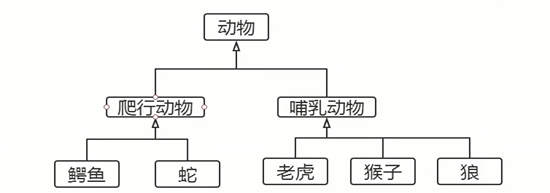

## python-面向对象-17-继承/object类/mro方法

### 1.继承的基本概念
继承是面向对象程序设计的重要特征，也是实现"代码复用"的重要手段。  
如果一个新类继承自一个设计好的类，就直接具备已有类的特征，这样就大大降低了工作难度，因为很多事情父类已经做了，不需要再重新做一遍，减少重复劳动。已有的类，我们称为`父类`或者`基类`，新的类，我们称为`子类`或者`派生类`。   

继承关系示意图：    
  


继承语法格式:  

```python
class 子类类名[(父类1 [, 父类2, ...])]
	类体结构
```
说明：  
1. 因为Python语言和C++一样是支持多重继承的，所有在继承的时候可以继承多个类。  **备注:关于多重继承的内容，后面的笔记会有具体说明**


### 2.object类

#### 2.1 object基础说明

在python中，所有类都继承自类`object`，也称之为`根基类`。  
当定义类的时候，只有类名，没有继承的相关参数时，则此时默认继承类`object`。  从另外一个角度理解，所有的类继承关系最上层都是类`object`,类`object`是所有类的父类，在`object`类中定义了所有类的共有的默认实现，比如:`__new__()`、`__init__()`等非常常见的方法。 

#### 2.2 mro方法定义

```python
def mro(self, *args, **kwargs): # real signature unknown
        """ Return a type's method resolution order. """
        pass
```
返回`type`方法的解析顺序，也就对应着类的继承关系。

#### 2.3 示例代码

```python
class Person:
    pass

class Student(Person):
    pass

print("使用mro函数")
print(Student.mro())

print("--" * 20)
print("使用__mro__属性")
print(Student.__mro__)
```
运行结果:
```python
使用mro函数
[<class '__main__.Student'>, <class '__main__.Person'>, <class 'object'>]
----------------------------------------
使用__mro__属性
(<class '__main__.Student'>, <class '__main__.Person'>, <class 'object'>)
```
代码说明：  
1. 使用mro方法和`__mro__`属性，两个的运行结果是一致的，说明在底层，两者相同。其中一个属于包装修饰的功能。  
2. 在代码中，我们首先定义类Person，没有指定继承关系；然后定义类Student，显示继承类Person;运行结果中，首先是类Student自身，然后是类Person，这个是因为我们显示继承的原因造成的。最后一个是类object，这个在一次说明，如果不指定继承关系，则默认继承类object


### 3.继承过程中注意事项
1. 定义子类时，必须早其构造函数中调用父类的构造方法，调用格式如下：  
`父类名.__init__(self [, 参数列表])`  
2. 通过继承方式获取的父类的私有属性和私有方法不能直接使用，只能通过`子类对象名._父类名__私有属性名`的方式进行调用。

示例代码：
```python
class Person:
    def __init__(self, name, age):
        self.name = name
        self.__age = age

    def say_age(self):
        print(self.name, "的年龄是:", self.__age, sep="")

class Student(Person):
    def __init__(self, name, age, score):
        self.score = score
        # 手动调用父类的__init__方法
        Person.__init__(self, name, age)

print("使用继承父类的公开的属性和方法")
s1 = Student("聂发俊", 100, 100)
print("s1.name=", s1.name, sep='')
s1.say_age()


print("使用继承父类私有的属性和方法")
print(dir(s1))
print(s1._Person__age)
print(s1.age)
```
运行结果：
```python
Traceback (most recent call last):
  File "test.py", line 27, in <module>
    print(s1.age)
AttributeError: 'Student' object has no attribute 'age'
使用继承父类的公开的属性和方法
s1.name=张三
聂发俊的年龄是:100
使用继承父类私有的属性和方法
['_Person__age', '__class__', '__delattr__', '__dict__', '__dir__', '__doc__', '__eq__', '__format__', '__ge__', '__getattribute__', '__gt__', '__hash__', '__init__', '__init_subclass__', '__le__', '__lt__', '__module__', '__ne__', '__new__', '__reduce__', '__reduce_ex__', '__repr__', '__setattr__', '__sizeof__', '__str__', '__subclasshook__', '__weakref__', 'name', 'say_age', 'score']
6
```
代码说明：
1. 类Student继承类Person，需要手动调用父类的`__init__`方法，因为这个不是`__new__`方法，是一个初始化方法，不是实际产生对象的方法，所以不会自动执行，需要手动调用。  
2. 子类Student使用父类Person的公开属性和公开方法say_age()均可以正常使用，说明通过继承，子类可以正常使用父类的公开的方法和属性。但是最后使用继承父类Person的私有属性`__age`的时候，报错了，说明通过继承，子类不能使用父类的私有属性和私有方法。


---
> 备注：   
> 更多精彩博客，请访问:[聂发俊的技术博客](http://www.niefajun.com/)  
> 对应视频教程，请访问:[python400](https://www.bilibili.com/video/BV1WE411j7p3)  
> 完整markdown笔记，请访问: [python400_learn_github](https://github.com/niefajun/python400_learn)


