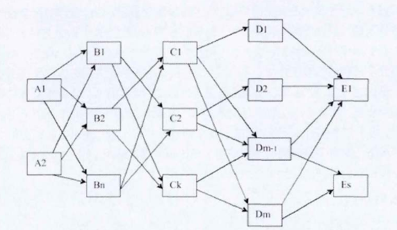
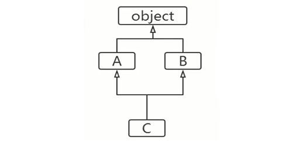

## python-面向对象-21-多重继承/方法解析顺序

### 1.多重继承基本介绍

Python语言支持多重继承，一个子类可以有多个"直接父类"，这样就具备了"多个父类"的方法和属性。
好处： 让我们的类定义的非常灵活 。  
坏处： 会破坏"类的整体层次"，搞得异常复杂。  
由于绝大多数情况下，单继承的方式就可以满足我们的需求，同时也是为了我们程序的可读性，稳定性，尽量避免使用。  

当使用多重继承，可能形成复杂的网状结构，如下图：   


> 由于建议在实际的生产中，不使用多重继承的功能，虽然多重继承的知识点有很多，我们也只是点到为止。

### 2.多重继承简单代码说明
多重继承示例代码：

```python
class A:
    def aa(self):
        print("aa")

class B:
    def bb(self):
        print("bb")


class C(B, A):
    def cc(self):
        print("cc")

c = C()
c.aa()
c.bb()
c.cc()
```

运行结果：
```
aa
bb
cc
```
程序说明:
1. 首先定义类A，其中包含方法aa，然后定义类B,其中包含方法bb，都是很常规的操作

2. 最后定义类C，并指定首先继承类B，然后继承类A，这样在类C中就包含父类B和父类A的全部方法，即：方法bb和方法aa，在加上自身定义的cc方法，则类C同时具有三个方法。  
构成如下继承结构示意图：  


3. 分别执行三个方法，并输出对应的结果，结果也对应输出


### 3.方法解析顺序MRO
使用多继承的时候，如果父类中有相同名字的方法，在子类没有指定父类名时，解释器将"从左到右"按顺序搜索。  
MRO(Method Resolution Order):方法解析顺序。我们可以通过mro方法()获得类的层次结构，这个在前面说类继承的时候，已经有介绍，详细内容可以参考前面的介绍。方法解析顺序也是按照这个"类的层次结构"寻找的。  

示例代码：
```python
class A:
    def say(self):
        print("aaa")
        
class B:
    def say(self):
        print("bbb")

class C(A, B):
    pass

class D(B, A):
    pass

c = C()
print(C.mro())
c.say()
print('--' * 20)

d = D()
print(D.mro())
d.say()
```
运行结果：
```
[<class '__main__.C'>, <class '__main__.A'>, <class '__main__.B'>, <class 'object'>]
aaa
----------------------------------------
[<class '__main__.D'>, <class '__main__.B'>, <class '__main__.A'>, <class 'object'>]
bbb
```
程序说明：
1. 首先定义类A，里面包含方法`say()`
2. 然后定义类B, 里面包含和类A相同名称的方法`say()`
3. 定义类C，指定先继承类A然后继承类B，由于类A和类B里面存在同名方法，最后采用类A的`say()`方法
4. 定义类D,指定先继承B然后继承类A，同样，由于类B和类A里面存在同名方法，最后采用类B的`say（）`方法。
5. 首先输出类C的类继承关系，然后执行`c.say()`，发现的两者顺序是一致的，同理对应类D的操作。

---
> 备注：   
> 更多精彩博客，请访问:[聂发俊的技术博客](http://www.niefajun.com/)  
> 对应视频教程，请访问:[python400](https://www.bilibili.com/video/BV1WE411j7p3)  
> 完整markdown笔记，请访问: [python400_learn_github](https://github.com/niefajun/python400_learn)


